# Workshop Overview

- Research questions → analysis plans
- Exploratory data analysis (EDA)
- Sampling & inference
- Choosing statistical tests
- Interpreting results

------------------------------------------------------------------------

# Research Question → Analysis Plan

Every analysis starts with a well-defined research question.

::: incremental
- Identify the **outcome** variable.
- Identify predictor and grouping variables.
- Determine whether observations are **independent** or **paired**.
- Decide whether your goal is **association**, **comparison**, **prediction**, or **estimation**. Note this will depend on your research question!
:::

------------------------------------------------------------------------

# Example

**Our Research Question**

Does fertilizer affect plant growth over a six-week period?

::::: columns
::: {.column width="50%"}
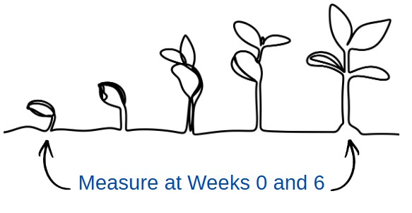
:::

::: {.column width="50%"}
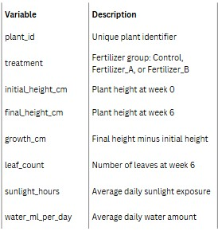
:::
:::::

------------------------------------------------------------------------

# Exploratory Data Analysis

### Data Types

::::: columns
::: {.column width="50%"}
- Numerical
  - Continuous
  - Discrete
- Categorical
  - Nominal
  - Ordinal
:::

::: {.column width="50%"}
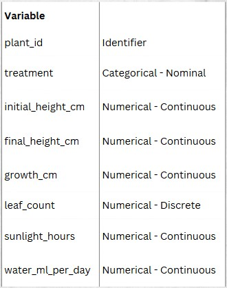
:::
:::::

------------------------------------------------------------------------

# Measures of Center

::::: columns
::: {.column width="50%"}
- Mean
- Median
:::

::: {.column width="50%"}
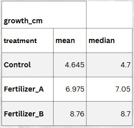
:::
:::::

::: callout-tip
Which measure is more robust to outliers?
:::

------------------------------------------------------------------------

# Measures of Variability

::::: columns
::: {.column width="50%"}
- Standard deviation
- Variance
- Percentiles
- Range
:::

::: {.column width="50%"}
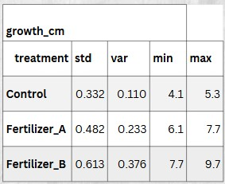
:::
:::::

::: callout-warning
Standard deviation and variance are sensitive to outliers.
:::

------------------------------------------------------------------------

# Visualizing Data

::::: columns
::: {.column width="50%"}
- To explore one quantitative variable:
  - Histogram: distribution shape
  - Boxplot: spread and outliers
- To summarize categorical data:
  - Frequency table: category counts
  - Bar chart: visual category counts or percentages; also shows mode, the most common category
- To compare groups:
  - Side-by-side boxplot
  - Violin plot
  - Dot plot or strip plot
- To explore relationships:
  - Scatterplot: could add the addition of a trend line 
- Explore changes over time
  - Line plot
- Explore many relationships
  - Correlation matrix
  - Heat map
:::

::: {.column width="50%"}
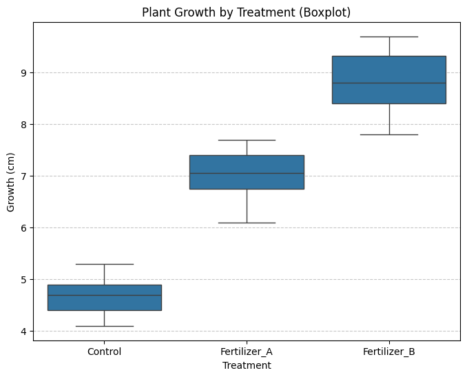
:::
::::

------------------------------------------------------------------------

# Correlation

:::: {.columns}
::: {.column width="50%"}
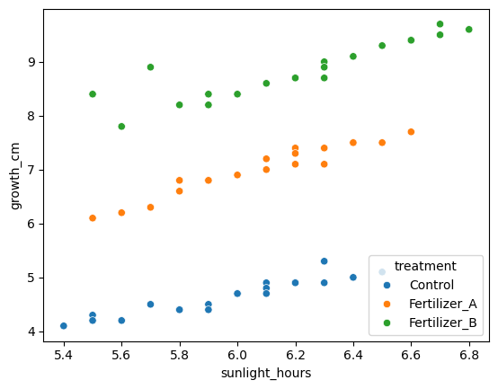
Scatterplots visualize association.
:::

::: {.column width="50%"}
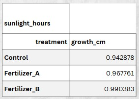
Correlation coefficient is a metric that ranges from **-1** to **1** measuring the association between two numerical variables.
:::
::::

------------------------------------------------------------------------

# Sampling Distributions

- Sample statistics vary.
- This variation is **sampling variability**.
- Sampling distributions describe repeated samples.

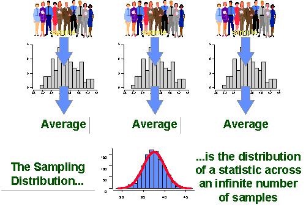

------------------------------------------------------------------------

# Confidence Intervals

A 95% confidence interval is produced by a method that would capture the true population value about 95% of the time over repeated samples.

------------------------------------------------------------------------

# Review of Hypothesis Testing

::::: columns
::: {.column width="50%"}
### Null Hypothesis

- No difference
- No effect
- No association
:::

::: {.column width="50%"}
### Alternative

- Difference
- Effect
- Association
:::
:::::
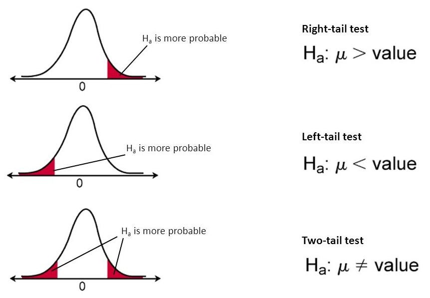

------------------------------------------------------------------------

# Choosing the Right Statistical Test

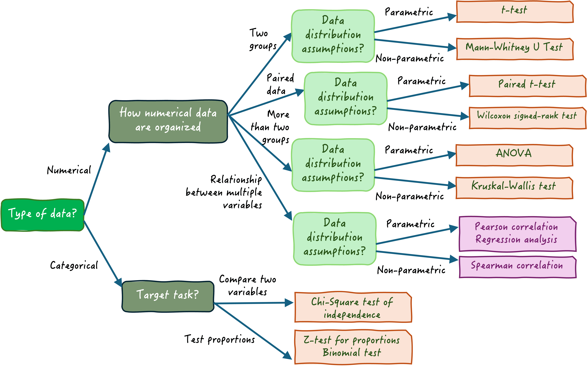

------------------------------------------------------------------------

# Parametric vs. Nonparametric

::::: columns
::: column
### Parametric

- Normality
- Equal variance
- Independence

Examples: - t-test - ANOVA - Pearson correlation - Linear regression
:::

::: column
### Nonparametric

- Rank-based
- Fewer assumptions
- Robust to skew/outliers

Examples: - Mann–Whitney U - Wilcoxon - Kruskal–Wallis - Spearman correlation
:::
:::::

------------------------------------------------------------------------

# t-Test

Use when:

- Outcome is quantitative
- Comparing one or two means
- Parametric assumptions hold

Types:

- One-sample
- Independent
- Paired

::: notes
Explain why multiple groups require ANOVA instead of repeated t-tests.
:::

------------------------------------------------------------------------

# ANOVA

- Compare 3+ group means
- One-way
- Two-way
- MANOVA

------------------------------------------------------------------------

# Effect Size

Effect size tells us **how large** an effect is.

Examples:

- Cohen's d
- Eta-squared
- Correlation coefficient

------------------------------------------------------------------------

# Interpretation Practice

What do these results tell us?

- p = 0.001, Cohen's d = 0.90
- p = 0.01, Cohen's d = 0.25
- p = 0.08, Cohen's d = 0.85, CI = -0.2 to 2.6 cm

## Result Interpretations

- p = 0.001, Cohen's d = 0.90
  - Strong evidence of difference between the two groups with large effect size. 
  - Likely practically meaningful

- p = 0.01, Cohen's d = 0.25
  - Statistically signficiant but small effect size.
  - May have limited practical importance

- p = 0.08, Cohen's d = 0.85, CI = -0.2 to 2.6 cm
  - Not statistically significant but estimated effect is fairly large. 
  - Confidence interval is very wide so more data would likely be helpful before drawing a conclusion.

------------------------------------------------------------------------

# Practice: Which Test?

1.  Compare two independent treatment groups.
2.  Compare before vs. after measurements.
3.  Compare four fertilizer treatments.
4.  Assess relationship between height and biomass.

## Which Test?

| Research question | Parametric option | Nonparametric alternative |
|---|---|---|
| Compare two independent groups | Independent samples t-test | Mann–Whitney U test |
| Compare before vs. after | Paired t-test | Wilcoxon signed-rank test |
| Compare four fertilizer treatments | One-way ANOVA | Kruskal–Wallis test |
| Assess relationship between height and biomass | Pearson correlation / regression | Spearman correlation |

------------------------------------------------------------------------

# Summary

::: incremental
- Start with the research question.
- Identify variables.
- Check assumptions.
- Choose the appropriate test.
- Report effect sizes—not just p-values.
:::

------------------------------------------------------------------------

# Resources

- [Practical Statistics for Data Scientists](https://github.com/Chandra0505/Data-Science-Resources/blob/master/machine-learning/Practical%20Statistics%20for%20Data%20Scientists.pdf)
- Office Hours on Wednesdays and Fridays
- Try out other online tutorials via platforms like DataCamp and LinkedIn Learning.

# Questions?